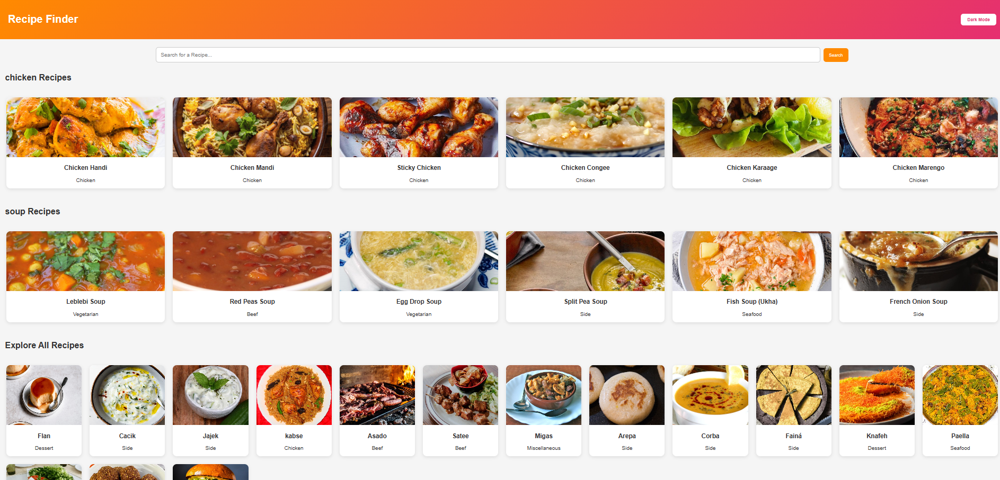
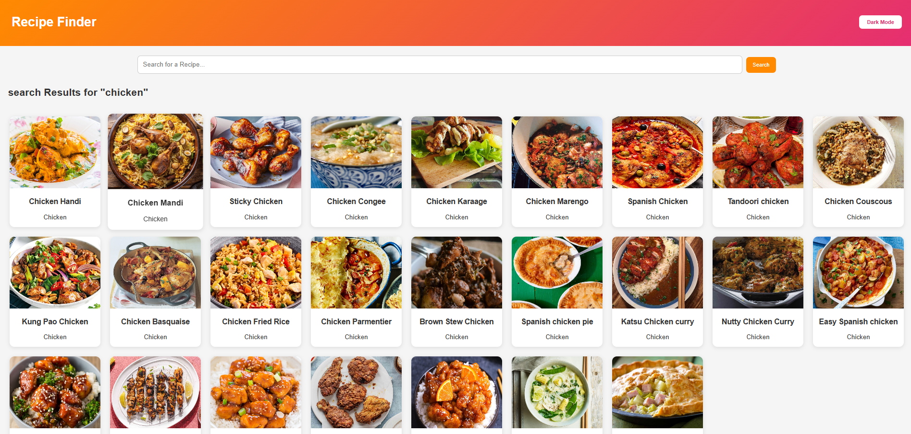
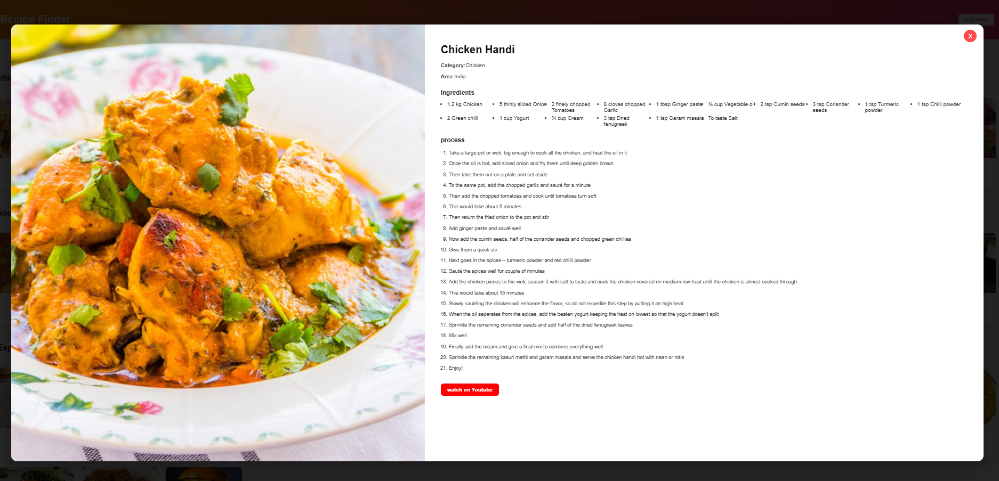
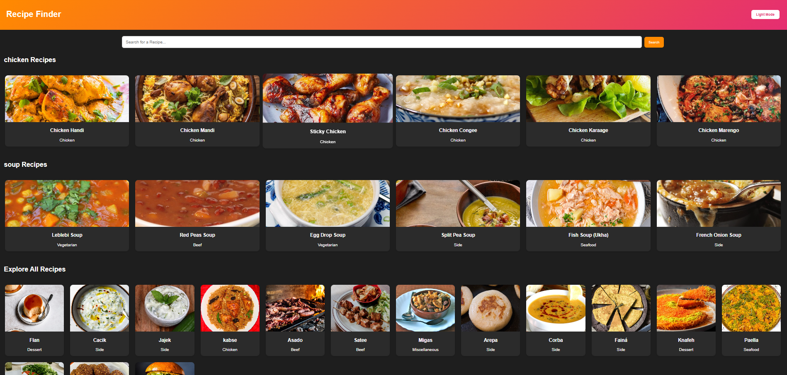

# 🍽️ Recipe Finder Web Application

A responsive and interactive Recipe Finder application built using React.js that allows users to search for recipes, explore ingredients, and view cooking instructions through real-time API integration.

---

# 📖 Project Description

Recipe Finder is a modern web application developed to help users discover recipes quickly and easily. Users can search for recipes by entering a dish name, and the application fetches relevant recipe data from an external API.

The application displays recipe images, ingredients, category information, cuisine type, and cooking instructions in a clean and user-friendly interface. It also includes Dark Mode functionality to improve user experience.

This project demonstrates practical implementation of React.js concepts, API integration, state management, responsive design, and component-based architecture.

---


# 🔗 Live Demo

Live Website:

https://saikumar-009.github.io/Recipe-Finder/

---

# 💻 GitHub Repository

Repository Link:

https://github.com/saikumar-009/recipe-finder

---

# 📸 Screenshots

## Home Page



---

## Search Results



---

## Recipe Details



---

## Dark Mode


---

# ✨ Features

### 🔍 Recipe Search
Users can search recipes by entering a dish name.

### 🍲 Recipe Details
Displays complete recipe information including:
- Recipe Name
- Recipe Image
- Category
- Cuisine Type
- Ingredients
- Cooking Instructions

### 🌙 Dark Mode
Allows users to switch between Light and Dark themes.

### 📱 Responsive Design
Optimized for:
- Mobile Devices
- Tablets
- Laptops
- Desktop Screens

### ⚡ API Integration
Fetches real-time recipe data from an external recipe API.

### 🚫 Error Handling
Displays user-friendly messages when:
- No recipes are found
- API requests fail
- Empty searches are performed

### 🔄 Dynamic Rendering
Recipe results update instantly based on user search input.

---

# 🛠️ Technologies Used

## Frontend Technologies

- React.js
- JavaScript (ES6+)
- HTML5
- CSS3

## API Integration

- Fetch API
- TheMealDB API

## Development Tools

- Git
- GitHub
- VS Code

---


# 🚀 How It Works

### Step 1

User enters a recipe name in the search bar.

Example:

```bash
Chicken
```

### Step 2

React sends a request to the Recipe API using Fetch API.

### Step 3

API returns recipe data.

### Step 4

The application displays matching recipes dynamically.

### Step 5

User can click on a recipe card to view detailed information.

---

# 🎯 Challenges Faced

During development, several challenges were encountered:

### API Data Handling

Managing asynchronous API responses and displaying data efficiently.

### Conditional Rendering

Showing loading states, error messages, and recipe data dynamically.

### Responsive Design

Ensuring proper layout across different screen sizes.

### Dark Mode Implementation

Managing theme state and applying dynamic styles.

### Component Reusability

Creating reusable React components for better maintainability.

---

# 📚 Key Learnings

This project helped me improve my understanding of:

- React Functional Components
- React Hooks
- State Management
- Props Handling
- API Integration
- Fetch API
- Conditional Rendering
- Responsive Design
- Component Reusability
- Git and GitHub Workflow

---

# ⚙️ Installation Guide

Follow the steps below to run the project locally.

## Step 1: Clone Repository

```bash
git clone https://github.com/yourusername/recipe-finder.git
```

## Step 2: Navigate to Project Directory

```bash
cd recipe-finder
```

## Step 3: Install Dependencies

```bash
npm install
```

## Step 4: Start Development Server

```bash
npm start
```

The application will start on:

```bash
http://localhost:3000
```

---

# 📂 Project Structure

```bash
recipe-finder/
│
├── public/
│
├── src/
│   │
│   ├── components/
│   │   ├── Navbar.jsx
│   │   ├── SearchBar.jsx
│   │   ├── RecipeCard.jsx
│   │   └── RecipeDetails.jsx
│   │
│   ├── pages/
│   │   └── Home.jsx
│   │
│   ├── App.jsx
│   ├── App.css
│   ├── index.js
│   │
│   └── assets/
│
├── screenshots/
│
├── package.json
│
└── README.md
```

---


# 🚀 Future Improvements

Planned enhancements for future versions:

- User Authentication
- Favorite Recipes Feature
- Recipe Categories Filter
- Advanced Search Options
- Pagination Support
- Meal Planner
- Recipe Sharing Feature
- Voice Search Functionality

---


# 👨‍💻 Author

Name: ALUPANA SAI

GitHub:
https://github.com/saikumar-009

LinkedIn:
https://www.linkedin.com/in/alupanasai/

Email:
alupanasai3535@gmail.com

---

# ⭐ Support

If you found this project useful, please consider giving it a ⭐ on GitHub.

It helps others discover the project and supports my learning journey.

---

Thank You for Visiting! 🚀
